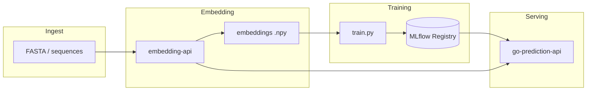

# CAFA-5 Protein Function Prediction

Production-ready ML pipeline for the [Kaggle CAFA-5 Protein Function Prediction competition](https://www.kaggle.com/competitions/cafa-5-protein-function-prediction), predicting Gene Ontology (GO) terms from protein language model embeddings (ESM-2, ProtBERT, T5).

## Project Structure

```
CAFA-5-Protein-Function-Prediction-MLOps/
├── configs/
│   └── config.yaml                # All hyperparams, paths, model selection
├── src/
│   ├── __init__.py
│   ├── config.py                  # YAML config loading + dataclass validation
│   ├── data/
│   │   ├── __init__.py
│   │   ├── dataset.py             # ProteinSequenceDataset (PyTorch Dataset)
│   │   └── preprocessing.py       # Build binary label matrix from train_terms.tsv
│   ├── models/
│   │   ├── __init__.py            # Factory function build_model()
│   │   ├── mlp.py                 # MultiLayerPerceptron
│   │   └── cnn1d.py               # CNN1D
│   ├── training/
│   │   ├── __init__.py
│   │   └── trainer.py             # Training loop, validation, checkpointing
│   ├── inference/
│   │   ├── __init__.py
│   │   └── predictor.py           # Load model + generate submission
│   └── utils.py                   # Seed setting, logging setup, device selection
├── scripts/
│   ├── train.py                   # CLI: python scripts/train.py --config configs/config.yaml
│   ├── predict.py                 # CLI: python scripts/predict.py --config configs/config.yaml
│   ├── preprocess.py            # CLI: generate label matrix from raw data
│   ├── embed_sequences.py       # CLI: HF embedding generation
│   └── smoke_embedding_api.sh   # Smoke test (curl + NumPy) for Embedding API
├── data/                          # .gitignored; user places data here
├── outputs/                       # .gitignored; checkpoints, logs, submissions
├── notebooks/
│   └── CAFA5-EMS2embeds-Pytorch.ipynb   # Archived original notebook
├── services/
│   └── embedding-api/           # FastAPI embedding service
├── requirements.txt
├── pyproject.toml
├── docker-compose.yml           # Embedding API (Docker Compose)
├── docker/
│   └── docker_embedding/
│       ├── Dockerfile.embedding-cli   # CLI: batch embedding image
│       └── Dockerfile.embedding-api   # Embedding API image
├── .gitignore
└── README.md
```

## Background

The Gene Ontology (GO) is a concept hierarchy describing biological function of genes and gene products at different levels of abstraction. This project frames GO term prediction as a **multi-label classification** problem: given a protein embedding, predict which of the top-N GO terms apply.

## Setup

### 1. Create environment

```bash
python -m venv .venv
source .venv/bin/activate   # Linux/macOS
pip install -r requirements.txt
```

Note: embedding generation can be memory-intensive (especially `prot_t5` / ProtT5-XL). Use a CUDA GPU and keep `embedding.fp16=true` for faster embedding on GPU.

### 2. Place data
Download CAFA-5 data from the [Kaggle competition page](https://www.kaggle.com/competitions/cafa-5-protein-function-prediction/data).

You can either:
- use precomputed embeddings (from Kaggle), or
- generate embeddings directly from `Train/train_sequences.fasta` with `scripts/embed_sequences.py`.

Then organize under `data/`:

```
data/
├── cafa-5-protein-function-prediction/
│   └── Train/
│       ├── train_terms.tsv
│       ├── train_sequences.fasta
│       └── ...
├── embeddings/                           # configured by `data.embeddings_dir`
│   ├── hf_esm2/
│   │   ├── train_embeddings.npy
│   │   ├── train_ids.npy
│   │   ├── holdout_embeddings.npy
│   │   └── holdout_ids.npy
│   ├── hf_protbert/
│   └── hf_prot_t5/
└── ...
```

### 3. Configure

Edit `configs/config.yaml` to adjust paths, model type, hyperparameters, and embedding source.

## Usage

### Preprocess labels 

```bash
python scripts/preprocess.py --config configs/config.yaml
```

Generates a binary label matrix (`.npy`) under `outputs/`.

### Split train/holdout
```bash
python scripts/split_train_holdout.py --config configs/config.yaml
```

### Generate embeddings (train split)
```bash
python scripts/embed_sequences.py --config configs/config.yaml \
  --ids-npy outputs/splits/train_ids.npy \
  --split train
```

### Generate embeddings (holdout split)
```bash
python scripts/embed_sequences.py --config configs/config.yaml \
  --ids-npy outputs/splits/holdout_ids.npy \
  --split holdout
```

## Generate embedding Test
```bash
python scripts/embed_sequences.py --config configs/config.yaml \
  --ids-npy outputs/splits/test_ids.npy \
  --split test
```

### (Optional) Evaluate holdout
```bash
python scripts/evaluate_holdout.py --config configs/config.yaml
```

### Train

```bash
python scripts/train.py --config configs/config.yaml
```

Trains the model, saves the best checkpoint (by val F1) to `outputs/checkpoints/best_model.pt`, and writes `outputs/training_history.json`.

### Predict

```bash
python scripts/predict.py --config configs/config.yaml [--checkpoint path/to/model.pt]
```

Produces `outputs/submission.tsv` in CAFA-5 format (Id, GO term, Confidence).

## Configuration

All parameters live in `configs/config.yaml`:

```yaml
data:
  data_dir: "data/cafa-5-protein-function-prediction"
  train_fasta: "data/cafa-5-protein-function-prediction/Train/train_sequences.fasta"
  embeddings_dir: "data/embeddings"
  embeddings_source: "ESM2"        # ESM2 | ProtBERT | T5
  num_labels: 500
  train_val_split: 0.9
  holdout_fraction: 0.1
  splits_dir: "outputs/splits"

embedding:
  backend: "esm2"                  # esm2 | prot_bert | prot_t5
  hf_cache_dir: "data/hf_cache"
  pooling: "mean"                  # mean | cls
  max_length: 1280
  batch_size: 8
  fp16: true
  num_workers: 0
  generated_subdir_prefix: "hf_"

model:
  type: "mlp"                      # mlp | cnn1d
  mlp_hidden_dims: [864, 712]
  cnn_out_channels: [3, 8]
  cnn_kernel_size: 3

training:
  epochs: 5
  batch_size: 128
  learning_rate: 0.001
  scheduler_factor: 0.1
  scheduler_patience: 1
  seed: 42

prediction:
  datatype: "holdout"

output:
  output_dir: "outputs"
```

## Models

- **MLP** (`mlp`): Configurable hidden-layer sizes, ReLU activations.
- **CNN1D** (`cnn1d`): Two 1-D conv layers with tanh activations, max pooling, and fully-connected output.

Both output raw logits (no final sigmoid) — `BCEWithLogitsLoss` handles the sigmoid internally for numerical stability.

## How to run with Docker

This section covers the **Embedding API** (FastAPI service under `services/embedding-api/`) and the **CLI embedding** image used for batch `.npy` generation.

### Prerequisites

- [Docker](https://docs.docker.com/get-docker/) and Docker Compose v2 (`docker compose`).
- Your Linux user should be in the `docker` group (or use `sudo docker ...`) so the daemon socket is usable.
- First API run will download the Hugging Face model into `./data/hf_cache` (mounted into the container).

### Embedding API (Recommended)

From the repository root:

```bash
docker compose up --build
```

The API listens on **http://127.0.0.1:8000**. Persisted on the host:

- `./outputs` → job SQLite DB and per-job `.npy` artifacts (`outputs/service_artifacts/<job_id>/`)
- `./data/hf_cache` → Hugging Face cache

Service-specific details: [services/embedding-api/README.md](services/embedding-api/README.md).

### Test (curl + artifact download)

With the stack running (`docker compose up`), in another terminal:


```bash
# Health
curl -sS http://127.0.0.1:8000/api/v1/health

# Submit a tiny job (2 sequences, esm2)
curl -sS -X POST http://127.0.0.1:8000/api/v1/jobs \
  -H "Content-Type: application/json" \
  -d '{
    "stage": "test",
    "backend": "esm2",
    "pooling": "mean",
    "batch_size": 2,
    "max_length": 1280,
    "sequences": [
      {"id": "P1", "sequence": "MKTAYIAKQRQISFVKSHFSRQ"},
      {"id": "P2", "sequence": "GAVLIPFYWSTCMNQDEKRH"}
    ]
  }'

# Poll: replace <JOB_ID> with the returned id
curl -sS http://127.0.0.1:8000/api/v1/jobs/<JOB_ID>

# Download artifacts when status is "succeeded"
curl -o test_ids.npy \
  http://127.0.0.1:8000/api/v1/jobs/<JOB_ID>/artifacts/test_ids.npy
curl -o test_embeddings.npy \
  http://127.0.0.1:8000/api/v1/jobs/<JOB_ID>/artifacts/test_embeddings.npy
```

### API output files and shapes

After a successful `test` job, the service writes (under the mounted `./outputs` tree):

| File | Role | Typical shape / dtype |
|------|------|------------------------|
| `outputs/service_artifacts/jobs.db` | Job queue / status / artifact metadata | SQLite |
| `outputs/service_artifacts/<job_id>/test_ids.npy` | Protein IDs in row order | `(N,)`, `object` |
| `outputs/service_artifacts/<job_id>/test_embeddings.npy` | Embedding matrix | `(N, D)`, `float32` |

For **`backend: esm2`**, `D = 1280`. For **`protbert`** or **`t5`**, `D = 1024`.

Verify locally with Python:

```python
import numpy as np
emb = np.load("test_embeddings.npy")
ids = np.load("test_ids.npy", allow_pickle=True)
assert emb.shape[0] == len(ids)
print(emb.shape, emb.dtype)
```

### CLI embedding (batch, no HTTP)

Build and run the CLI image (outputs follow `configs/config.yaml` paths under mounted `./data`):

```bash
docker build -f docker/docker_embedding/Dockerfile.embedding-cli -t cafa5-embedding-cli:cpu .
docker run --rm \
  -v "$(pwd)/data:/app/data" \
  -v "$(pwd)/outputs:/app/outputs" \
  cafa5-embedding-cli:cpu \
  --config configs/config.yaml \
  --fasta examples/small_sequences.fasta \
  --split test
```

### Future improvements

- **GPU image**: base image with CUDA + GPU PyTorch; optional `deploy.resources` / `--gpus all` in Compose for faster embedding.
- **Queue backend**: Redis/RQ, Celery, or cloud task queues for multi-worker embedding and back-pressure instead of a single in-process worker.
- **Train / holdout stages**: extend the API to build label matrices, splits, and `train_*` / `holdout_*` embeddings as in the batch script.
- **Registry / CI deployment**: push images to GHCR/ECR/GCR; GitHub Actions (build, scan, push); optional Kubernetes manifests or managed container services for production.

## Integrated Embedding -> GO API

To run both teammate services together (embedding + GO prediction + MLflow):

```bash
docker compose up --build
```

Ports:

- `embedding-api`: `http://127.0.0.1:8000`
- `go-prediction-api`: `http://127.0.0.1:8001`
- `mlflow`: `http://127.0.0.1:5000`

Integration flow:

1. Submit embedding job (`POST /api/v1/jobs` or `/api/v1/jobs/fasta`) to `embedding-api`.
2. Poll until status is `succeeded`.
3. Trigger GO inference directly from embedding artifacts:

```bash
curl -sS -X POST "http://127.0.0.1:8000/api/v1/jobs/<JOB_ID>/predict-go" \
  -H "Content-Type: application/json" \
  -d '{"top_k": 10}'
```

Optional request fields:

- `indices`: subset of embedding row indices to score (e.g. `[0, 3, 7]`)
- `fail_fast`: default `true`; set `false` to continue on per-sequence failures and collect them in `failures`.

One-shot endpoint (submit + wait + predict in one call):

```bash
curl -sS -X POST "http://127.0.0.1:8000/api/v1/predict-go-from-sequences" \
  -H "Content-Type: application/json" \
  -d '{
    "backend": "esm2",
    "pooling": "mean",
    "batch_size": 2,
    "max_length": 1280,
    "top_k": 10,
    "sequences": [
      {"id": "P1", "sequence": "MKTAYIAKQRQISFVKSHFSRQ"},
      {"id": "P2", "sequence": "GAVLIPFYWSTCMNQDEKRH"}
    ]
  }'
```
### API Request Scenarios (examples)

Assuming the integrated stack is running:

```bash
docker compose up --build
```

Service URLs:

- Embedding API: `http://127.0.0.1:8000`
- GO Prediction API: `http://127.0.0.1:8001`

Quick health checks:

```bash
curl -sS http://127.0.0.1:8000/api/v1/health
curl -sS http://127.0.0.1:8001/health
```

#### 1) Send amino acid sequences -> return embedding vectors

Submit JSON sequences to `embedding-api`, poll job status, then download `.npy` artifacts.

```bash
# 1) Submit job
RESP=$(curl -sS -X POST http://127.0.0.1:8000/api/v1/jobs \
  -H "Content-Type: application/json" \
  -d '{
    "stage": "test",
    "backend": "esm2",
    "pooling": "mean",
    "batch_size": 2,
    "max_length": 1280,
    "sequences": [
      {"id": "P1", "sequence": "MKTAYIAKQRQISFVKSHFSRQ"},
      {"id": "P2", "sequence": "GAVLIPFYWSTCMNQDEKRH"}
    ]
  }')

echo "$RESP"

# 2) Extract job_id
JOB_ID=$(python - <<'PY'
import json,sys
print(json.loads(sys.stdin.read())["job_id"])
PY
<<< "$RESP")

echo "JOB_ID=$JOB_ID"

# 3) Poll until succeeded
curl -sS "http://127.0.0.1:8000/api/v1/jobs/$JOB_ID"

# 4) Download embeddings + ids
curl -sS -o test_ids.npy \
  "http://127.0.0.1:8000/api/v1/jobs/$JOB_ID/artifacts/test_ids.npy"
curl -sS -o test_embeddings.npy \
  "http://127.0.0.1:8000/api/v1/jobs/$JOB_ID/artifacts/test_embeddings.npy"
```

Optional shape check:

```bash
python - <<'PY'
import numpy as np
ids = np.load("test_ids.npy", allow_pickle=True)
emb = np.load("test_embeddings.npy")
print("ids:", ids.shape, ids.dtype)
print("emb:", emb.shape, emb.dtype)
PY
```

#### 2) Send FASTA file -> return embedding vectors

Upload FASTA to `embedding-api`.

```bash
# Example FASTA file
cat > sample.fasta <<'EOF'
>P1
MKTAYIAKQRQISFVKSHFSRQ
>P2
GAVLIPFYWSTCMNQDEKRH
EOF

# 1) Submit FASTA job
RESP=$(curl -sS -X POST http://127.0.0.1:8000/api/v1/jobs/fasta \
  -F "fasta_file=@sample.fasta" \
  -F "backend=esm2" \
  -F "pooling=mean" \
  -F "batch_size=2" \
  -F "max_length=1280")

echo "$RESP"

# 2) Extract job_id
JOB_ID=$(python - <<'PY'
import json,sys
print(json.loads(sys.stdin.read())["job_id"])
PY
<<< "$RESP")

# 3) Poll + download artifacts
curl -sS "http://127.0.0.1:8000/api/v1/jobs/$JOB_ID"
curl -sS -o test_ids.npy \
  "http://127.0.0.1:8000/api/v1/jobs/$JOB_ID/artifacts/test_ids.npy"
curl -sS -o test_embeddings.npy \
  "http://127.0.0.1:8000/api/v1/jobs/$JOB_ID/artifacts/test_embeddings.npy"
```

#### 3) Send embedding vector -> return GO predictions

Call `go-prediction-api` directly with one embedding vector (length must be `1280`).

```bash
python - <<'PY'
import json
import numpy as np
import requests

# Replace with your real embedding. This example loads first row from file:
emb = np.load("test_embeddings.npy")[0].astype(float).tolist()

payload = {"embedding": emb, "top_k": 10}
r = requests.post("http://127.0.0.1:8001/predict", json=payload, timeout=60)
print("status:", r.status_code)
print(json.dumps(r.json(), indent=2))
PY
```

#### 4) Send sequence list -> return GO predictions

Use one-shot endpoint on `embedding-api`: embed + wait + GO predict in one call.

```bash
curl -sS -X POST "http://127.0.0.1:8000/api/v1/predict-go-from-sequences" \
  -H "Content-Type: application/json" \
  -d '{
    "backend": "esm2",
    "pooling": "mean",
    "batch_size": 2,
    "max_length": 1280,
    "top_k": 10,
    "sequences": [
      {"id": "P1", "sequence": "MKTAYIAKQRQISFVKSHFSRQ"},
      {"id": "P2", "sequence": "GAVLIPFYWSTCMNQDEKRH"}
    ]
  }'
```

Useful optional fields:

- `indices`: predict only selected rows (e.g. `[0, 1]`)
- `fail_fast`: default `true`; set `false` to continue and collect per-sequence failures
- `timeout_seconds`, `poll_interval_seconds`: control waiting behavior

#### 5) Send FASTA -> return GO predictions

Current API supports this as a 2-step flow (FASTA job, then GO prediction from job artifacts).

```bash
# 1) Submit FASTA for embedding
RESP=$(curl -sS -X POST http://127.0.0.1:8000/api/v1/jobs/fasta \
  -F "fasta_file=@sample.fasta" \
  -F "backend=esm2" \
  -F "pooling=mean" \
  -F "batch_size=2" \
  -F "max_length=1280")

JOB_ID=$(python - <<'PY'
import json,sys
print(json.loads(sys.stdin.read())["job_id"])
PY
<<< "$RESP")

# 2) Poll until embedding job succeeds
curl -sS "http://127.0.0.1:8000/api/v1/jobs/$JOB_ID"

# 3) Trigger GO prediction from embedding artifacts
curl -sS -X POST "http://127.0.0.1:8000/api/v1/jobs/$JOB_ID/predict-go" \
  -H "Content-Type: application/json" \
  -d '{"top_k": 10}'
```

Notes:

- `go-prediction-api` expects embedding dimension `1280` (ESM2-compatible path).
- For large FASTA payloads, use moderate `batch_size` to reduce memory pressure.
- If a request fails, inspect logs:
  - `docker compose logs -f embedding-api`
  - `docker compose logs -f go-prediction-api`

## Docker Compose stack (`docker-compose.yml`)

| Service | Image / build | Host port | Purpose |
|---------|----------------|-----------|---------|
| **mlflow** | `ghcr.io/mlflow/mlflow:v2.13.0` | **5000** | Tracking server; `./mlruns` mounted |
| **go-prediction-api** | `docker/docker_go_term/Dockerfile.api` | **8001** →8000 | Inference API; `MODEL_URI` default `models:/cafa-go-model@champion` |
| **embedding-api** | `docker/docker_embedding/Dockerfile.embedding-api` | **8000** | Embedding jobs + integration hooks to GO API |
| **trainer** | `docker/docker_training/Dockerfile.training` | — | **Profile `training`**: runs `scripts/retrain_pipeline.py` |

**Bring up the inference stack (no training):**

```bash
docker compose up --build
```

**Include automated retrain + eval + promotion** (requires training data and embeddings mounted under `./data` and `./outputs` as in the compose file):

```bash
docker compose --profile training up --build
```

Environment variables of note: `REGISTERED_MODEL_NAME`, `PROMOTION_THRESHOLD`, `MLFLOW_TRACKING_URI`, `MODEL_CACHE_DIR` for the GO API.

The **training** image copies a minimal subset of the repo (see `Dockerfile.training`); full training in containers assumes you mount **`./data`** and **`./outputs`** so embeddings, FASTA, and splits are available.

---

## HTTP services

### Embedding API (`services/embedding-api`)

- **FastAPI** service: submit **JSON sequences** or **FASTA**, poll job status, download **`test_ids.npy`** / **`test_embeddings.npy`** (for `stage: test`).
- Artifacts and SQLite job store under `outputs/service_artifacts/`.
- Can call the **GO prediction API** after a job completes (e.g. `predict-go` on a job, or one-shot `predict-go-from-sequences`).
- Detailed endpoint list: `services/embedding-api/README.md`.

### GO prediction API (`services/go-prediction-api`)

- **`GET /health`** — reports whether the model and metadata loaded.
- **`POST /predict`** — JSON body with `embedding` (float list) and `top_k`; returns top GO terms with scores.
- Startup loads weights from **MLflow Model Registry** when `MODEL_URI` is set (default **`models:/cafa-go-model@champion`**), using **`model_loader.load_model_from_registry`**, with **`model_meta.json`**-compatible architecture and **`term_names.npy`** for human-readable labels.
- Optional MLflow logging for inference (see `mlflow_logger.py`).

**Important:** The default GO API path is tuned for **ESM-2 (1280-d embeddings)**. Other backends (1024-d) require a matching trained model and metadata in the registry.

---

## End-to-end integration (high level)



1. Sequences are embedded (CLI, Docker CLI image, or **embedding-api**).
2. **train.py** consumes training embeddings + labels, logs and registers models.
3. **evaluate_holdout.py** and **promote_model.py** qualify new versions; **`champion`** points production inference at an approved version.
4. **go-prediction-api** resolves `MODEL_URI` and serves **top-k GO** predictions.

---

## Dependencies (summary)

- **Core:** Python ≥3.10, PyTorch, NumPy, pandas, PyYAML, torchmetrics, matplotlib, **transformers**, **safetensors**, **MLflow 2.13.0**.
- **Services:** FastAPI, Uvicorn, python-multipart.
- **Container base images:** Python slim for app images; official MLflow image for the tracking server.

---

## License

MIT
